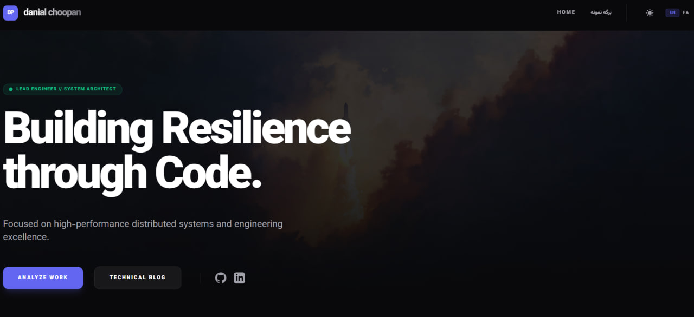

# DevPortfolio Danial 

[](https://wordpress.org)
[](https://tailwindcss.com)
[](https://opensource.org/licenses/GPL-2.0)

**DevPortfolio Pro** is a highly professional, enterprise-grade custom WordPress theme architected for Senior Software Engineers. It features a minimalist, high-tech aesthetic with a focus on performance, accessibility, and technical depth.

## ✨ Core Features (New & Enhanced)

- **🚀 Local Asset Architecture:** Completely independent of external CDNs. Tailwind CSS and Vazirmatn fonts are bundled locally for maximum privacy and performance.
- **🛠️ Theme Options Panel:** A dedicated settings page in the Admin Dashboard for managing:
  - **Site Language:** Instant toggle between English (LTR) and Farsi (RTL).
  - **Contact Info:** Global management of email and phone numbers.
  - **Social Matrix:** Centralized links for GitHub and LinkedIn.
- **📩 Advanced Contact System:** Custom-built contact form handling that saves messages directly to a "Contact Messages" CPT and sends email notifications.
- **📐 Optimized Portfolio Grid:** Responsive grid layout (1, 3, or 4 columns) for project showcases.
- **📄 Custom Page Templates:** Professionally designed templates for **Contact Me** and **About Me** pages.
- **Accessibility Optimized:** Sharp text contrast in both dark and light modes for maximum readability.

## 💎 Visual Showcase

### 🏠 Home Desktop



*Featuring a high-impact hero section and technical competency grid.*


## 🛠️ Installation & Setup Guide

1. **Clone the repository:**
   ```bash
   cd wp-content/themes
   git clone https://github.com/danialchoopan/danialchoopan.ir.git
   ```

2. **Activate the theme:**
   Log in to your WordPress dashboard, navigate to **Appearance > Themes**, and activate **DevPortfolio Pro**.

3. **Configure Theme Options:**
   Go to **Theme Options** in the sidebar. Set your preferred site language, contact email, phone number, and social media links. These will be automatically displayed on the contact page.

4. **Setup Contact Me Page:**
   - Go to **Pages > Add New**.
   - Set the title to "Contact Me".
   - In the **Page Attributes** section on the right, select the **Contact Me** template.
   - Publish the page. It will now show your contact info and the functional form.

5. **Setup About Me Page:**
   - Go to **Pages > Add New**.
   - Set the title to "About Me".
   - Select the **About Me** template in **Page Attributes**.
   - Add your bio content in the editor. The template will automatically display your technical DNA cards on the side.

6. **Manage Messages:**
   All submissions from the contact form are stored in the **Messages** menu in your WordPress dashboard. You can view, manage, and reply to inquiries from there.

7. **Configure Navigation:**
   Create your menus under **Appearance > Menus** and assign them to the **Primary Menu** and **Footer Menu** locations.

## ⚙️ Technical Standards

- **Security:** Strict adherence to WordPress standards (escaping, sanitization, nonces).
- **Hooks:** Extensible architecture using standard WordPress hooks.
- **Performance:** Pre-compiled local CSS and locally hosted assets for sub-second load times.

## 📝 License

This project is licensed under the GNU General Public License v2 or later.

---
Built with ❤️ by [Danial Choopan](https://danialchoopan.ir)

---

# قالب وردپرس DevPortfolio (فارسی)

**DevPortfolio Pro** یک قالب وردپرس سفارشی، حرفه‌ای و در سطح سازمانی است که برای مهندسان ارشد نرم‌افزار طراحی شده است. این قالب دارای زیبایی‌شناسی مینیمالیست و تکنولوژی بالا با تمرکز بر عملکرد، دسترسی‌پذیری و عمق فنی است.

## ✨ ویژگی‌های کلیدی (جدید و بهبود یافته)

- **🚀 معماری دارایی‌های محلی:** کاملاً مستقل از CDNهای خارجی. تمامی فایل‌های Tailwind CSS و فونت وزیرمتن به صورت محلی در قالب قرار داده شده‌اند تا حداکثر حریم خصوصی و سرعت فراهم شود.
- **🛠️ پنل تنظیمات قالب:** یک صفحه تنظیمات اختصاصی در پیشخوان وردپرس برای مدیریت:
  - **زبان سایت:** جابجایی آنی بین انگلیسی (چپ‌چین) و فارسی (راست‌چین).
  - **اطلاعات تماس:** مدیریت سراسری ایمیل و شماره تلفن.
  - **شبکه‌های اجتماعی:** مدیریت متمرکز لینک‌های گیت‌هاب و لینکدین.
- **📩 سیستم تماس پیشرفته:** فرم تماس سفارشی با قابلیت ذخیره پیام‌ها در یک پست‌تایپ اختصاصی (Contact Messages) و ارسال اعلان ایمیلی.
- **📐 گرید بهینه پورتفولیو:** چیدمان گرید واکنش‌گرا (۱، ۳ یا ۴ ستون) برای نمایش پروژه‌ها.
- **📄 الگوهای صفحه سفارشی:** الگوهای طراحی شده حرفه‌ای برای صفحات **تماس با من** و **درباره من**.
- **دسترسی‌پذیری بهینه:** کنتراست بالای متن در هر دو حالت تیره و روشن برای خوانایی حداکثری.

## 🛠️ راهنمای نصب و راه‌اندازی

۱. **کلون کردن مخزن:**
   ```bash
   cd wp-content/themes
   git clone https://github.com/danialchoopan/danialchoopan.ir.git
   ```

۲. **فعال‌سازی قالب:**
   به پیشخوان وردپرس بروید، به بخش **نمایش > پوسته ها** رفته و **DevPortfolio Pro** را فعال کنید.

۳. **پیکربندی تنظیمات قالب:**
   به منوی **Theme Options** در ستون کناری بروید. زبان سایت، ایمیل تماس، شماره تلفن و لینک‌های اجتماعی خود را تنظیم کنید. این اطلاعات به طور خودکار در صفحه تماس نمایش داده می‌شوند.

۴. **راه‌اندازی صفحه تماس با من:**
   - به بخش **برگه ها > افزودن جدید** بروید.
   - عنوان را "تماس با من" بگذارید.
   - در بخش **ویژگی های برگه** در سمت چپ، الگوی **Contact Me** را انتخاب کنید.
   - برگه را منتشر کنید. اکنون اطلاعات تماس و فرم عملیاتی شما نمایش داده می‌شود.

۵. **راه‌اندازی صفحه درباره من:**
   - به بخش **برگه ها > افزودن جدید** بروید.
   - عنوان را "درباره من" بگذارید.
   - الگوی **About Me** را انتخاب کنید.
   - محتوای بیوگرافی خود را در ویرایشگر وارد کنید. قالب به طور خودکار کارت‌های مهارت‌های فنی شما را در کنار صفحه نمایش می‌دهد.

۶. **مدیریت پیام‌ها:**
   تمامی پیام‌های ارسال شده از طریق فرم تماس در منوی **Messages** در پیشخوان وردپرس ذخیره می‌شوند. شما می‌توانید از آنجا پیام‌ها را مشاهده و مدیریت کنید.

۷. **تنظیم فهرست‌ها:**
   فهرست‌های خود را در بخش **نمایش > فهرست ها** ایجاد کرده و آن‌ها را به مکان‌های **Primary Menu** و **Footer Menu** اختصاص دهید.

## ⚙️ استانداردهای فنی

- **امنیت:** رعایت دقیق استانداردهای وردپرس (اعتبارسنجی، پاکسازی داده‌ها و Nonceها).
- **هوک‌ها:** معماری قابل گسترش با استفاده از هوک‌های استاندارد وردپرس.
- **عملکرد:** استفاده از CSS محلی کامپایل شده و دارایی‌های میزبانی شده داخلی برای سرعت بارگذاری زیر یک ثانیه.

---
ساخته شده با ❤️ توسط [دانیال چوپان](https://danialchoopan.ir)
