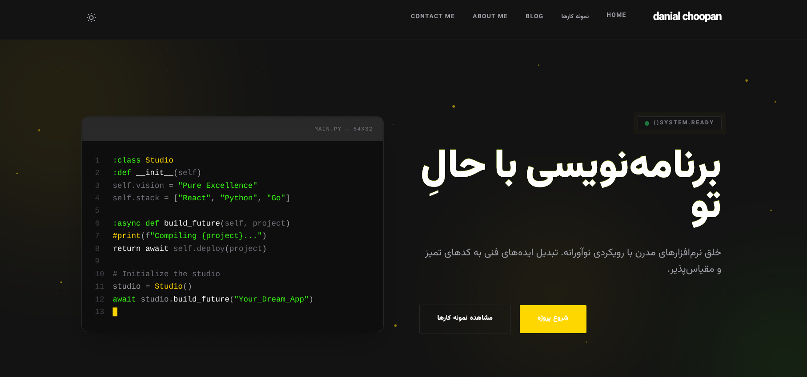

# Danial Portfolio — Premium Developer Portfolio WordPress Theme

> A fully offline, fully customizable WordPress theme for software engineers, freelancers, and studios. Zero external CDNs — everything loads from local files.


## Screenshots




---

## Table of Contents

1. [Features](#features)
2. [What We Built](#what-we-built)
3. [Installation](#installation)
4. [Quick Start](#quick-start)
5. [Customizer Sections](#customizer-sections)
6. [Admin Dashboard](#admin-dashboard)
7. [Custom Post Types](#custom-post-types)
8. [Animations & Effects](#animations--effects)
9. [CSS Animation Classes](#css-animation-classes)
10. [Shortcodes](#shortcodes)
11. [File Structure](#file-structure)
12. [Architecture](#architecture)
13. [Bugs Fixed](#bugs-fixed)
14. [What To Add Next](#what-to-add-next)
15. [Changelog](#changelog)
16. [License](#license)

---

## Features

### 100% Offline
| Asset | How |
|-------|-----|
| Vazirmatn font | 7 weights loaded from local `.woff2` files in `assets/fonts/vazirmatn/` |
| CSS utilities | 750+ lines of Tailwind-like utilities bundled in `assets/css/main.css` |
| JavaScript | All features in `assets/js/main.js` — zero framework dependencies |
| Prism.js | Code highlighting core + autoloader + theme bundled locally |
| **Zero external requests** | Works on localhost, intranet, air-gapped servers, or offline |

### Dark / Light Mode
- Toggle button in header with **sun ☀ / moon ☾ icon swap**
- Smooth CSS transition between modes (0.3s)
- Preference saved to `localStorage` — persists across sessions
- All Customizer colors apply in both modes
- Light mode: white backgrounds, dark text, neutral borders

### Terminal Animations (Hero)
- **Line-by-line reveal** — 13 lines of Python code appear one at a time (180ms stagger)
- **Blinking cursor** — Animated `█` at line 13
- **Typing effect** — `SYSTEM.READY()` types character by character on the status badge
- **Code shimmer** — Subtle golden light sweep across code blocks

### Floating Particles
- **20 animated particles** float upward in the hero section
- Randomized size (2-6px), position, delay (0-6s), and duration (4-10s)
- Uses the primary brand color from Customizer
- Adapts to light/dark mode automatically

### Counter Animation
- Stats numbers **count up from 0** when scrolled into view
- Handles prefixes (`+`) and suffixes (`k`, `%`)
- Smooth 25ms intervals with step acceleration
- IntersectionObserver triggers once per element

### Scroll Reveal
- Staggered entrance — sections animate in sequence (80ms delay between)
- 4 variants: default (fade up), `from-left`, `from-right`, `scale-in`
- IntersectionObserver-based (no jQuery)
- Toggleable via Customizer

### Contact Form
- AJAX submission (no page reload)
- Server-side validation + nonce verification
- Saves to `contact_messages` CPT with name, email, IP, read/unread status
- Email notification to admin with `Reply-To` header
- Admin columns: From, Email, Subject, Date, Status

### SEO
- Open Graph tags (`og:title`, `og:type`, `og:url`, `og:image`)
- Twitter Card meta tags (`summary_large_image`)
- JSON-LD structured data (Person schema with social links)

### More Animations
| Animation | Class | Effect |
|-----------|-------|--------|
| Card lift | `card-lift` | Rise + shadow on hover |
| Glow hover | `glow-hover` | Golden glow border on hover |
| Neon border | `neon-border` | Permanent glow border |
| Gradient text | `gradient-text` | Primary-to-secondary gradient |
| Matrix rain | `matrix-bg` | Binary code CSS background |
| Float | `float` | Gentle up/down bobbing |
| Pulse ring | `pulse-ring` | Expanding border ring |
| Hero title entrance | `hero-title` | Slides up on page load |
| Status badge pulse | `status-badge` | Glowing dot animation |

---

## What We Built

### Phase 1: Core Theme
- MVC architecture with PSR-4 autoloader (`src/` directory)
- Custom post types: Portfolio, Contact Messages, Testimonials
- Portfolio taxonomy: Portfolio Categories
- Blog with sidebar, search, categories, reading time
- About and Contact page templates
- Custom 404 page with terminal design
- Navigation walker with Tailwind classes
- Language switcher (Farsi + English)
- RTL/LTR support

### Phase 2: Bug Fixes
- Fixed CSS not loading (was using `@tailwind` directives in browser)
- Fixed dark mode inversion (`.dark-mode` had light colors)
- Fixed dark mode not restoring on page load
- Fixed font loading (missing local `@font-face` declarations)
- Fixed header scroll jump (no CSS transition for transform)
- Fixed `grid-pattern` defined twice (inline + CSS)
- Fixed XSS vulnerabilities (13 unescaped outputs)
- Fixed `page_template` key in `wp_insert_post()` (use `meta_input`)
- Fixed `get_the_category()[0]` crash on empty categories
- Fixed `mb_substr` crash on empty client name
- Fixed `esc_html()` used on URLs (should be `esc_url()`)
- Fixed dynamic Tailwind classes not compiling (use inline styles)
- Fixed mobile menu not toggling

### Phase 3: Admin & Customizer
- Full admin dashboard with stats, recent messages, quick links
- 30+ Customizer sections with 130+ controls
- Contact form with email notifications and admin columns
- GitHub API integration with 12-hour caching
- Developer rank shortcode
- Daily coding challenge shortcode

### Phase 4: Animations & Polish
- Terminal line-by-line reveal animation
- Floating particles background
- Counter animation for stats
- Dark/light toggle with icon swap
- Scroll reveal with stagger effect
- 15+ CSS animation utility classes
- Hero title entrance animation
- Status badge pulse effect
- Card lift, glow hover, neon border
- Ambient glow orbs in hero
- CRT scanline effect on terminal
- Glitch text effect on hero title

### Phase 5: Full Customization
- Branding: logo, tagline, favicon
- Header: height, opacity, blur, border
- Hero: height, terminal speed, particles, glow, scanline, glitch
- Terminal: 12 customizable code lines
- Footer: columns, background, padding
- Contact form: all labels, messages, placeholders
- About page: subtitle, description, avatar
- WhatsApp floating button
- Custom code injection (head + footer)
- Custom CSS textarea
- Animation speed controls
- Portfolio: aspect ratio, hover effect, excerpt
- Blog: excerpt length, read more, show/hide elements
- Social SEO: OG image, share description
- Farsi-only language (RTL)

### Phase 5: Offline & Theming
- Removed all CDN dependencies (Google Fonts, Tailwind CDN, Prism.js CDN)
- Local Vazirmatn font (7 weights)
- Comprehensive offline CSS (750+ lines)
- Only Farsi + English languages
- Full light mode support
- Terminal on LEFT, text on RIGHT in hero

---

## Installation

1. **Download** the theme ZIP
2. **Upload** to `/wp-content/themes/danial-portfolio/` or via Admin → Appearance → Themes → Upload
3. **Activate** the theme
4. **Set Homepage**: Settings → Reading → "A static page" → Select "Home"
5. **Configure**: Danial Portfolio → Settings or Appearance → Customize

The theme auto-creates Home, About, and Contact pages on first activation.

---

## Quick Start

| Step | Where | What |
|------|-------|------|
| 1 | Customize → Colors | Change primary/secondary/background colors |
| 2 | Customize → Hero | Edit title, bio, CTA buttons |
| 3 | Danial Portfolio → Portfolios | Add portfolio items with featured images |
| 4 | Danial Portfolio → Testimonials | Add client reviews with star ratings |
| 5 | Danial Portfolio → Settings | Add GitHub token, social links |
| 6 | Appearance → Menus | Create "Primary" menu |
| 7 | Customize → Homepage Sections | Toggle/reorder sections |

---

## Customizer Sections (30+)

| Section | Priority | Controls |
|---------|----------|----------|
| **Branding & Logo** | 20 | Logo image, logo width, show tagline, favicon |
| **Typography** | 25 | Body font size, H1 size, H2 size, line height |
| **Colors & Skins** | 30 | Primary color, secondary color, background, surfaces, border |
| **Hero Section** | 35 | Title, bio, CTA text/URLs, terminal toggle |
| **Hero Advanced** | 36 | Min height, terminal speed, particles count/toggle, glow, scanline, glitch |
| **Terminal Code** | 37 | 12 customizable code lines |
| **Services** | 48 | Section subtitle, title, 4 service titles + descriptions |
| **Stats** | 47 | 4 stat numbers + labels |
| **Social Links** | 45 | GitHub URL/handle, Twitter/X, LinkedIn, Telegram, Instagram, public email |
| **Homepage Sections** | 46 | Section order (comma-separated), show/hide each section |
| **Layout & Footer** | 40 | Copyright text, portfolio columns (1-4), container width |
| **Theme Features** | 50 | Preloader toggle, scroll reveal toggle, code highlighting toggle |
| **Testimonials** | 52 | Show/hide, subtitle, title |
| **Call to Action** | 54 | Show/hide, title, description, button text/URL |
| **404 Page** | 56 | Custom title, custom message |
| **Blog** | 58 | Subtitle, title, posts per page |
| **Header** | 60 | CTA button text/URL/toggle |
| **Header Advanced** | 61 | Height, background opacity, border, backdrop blur |
| **Footer** | 62 | Description, nav toggle, back-to-top text |
| **Footer Advanced** | 63 | Grid columns, background color, padding, social toggle |
| **Portfolio** | 64 | Subtitle, title, item count, view-all text/URL |
| **Contact Form** | 65 | Success/error/sending messages, field labels, submit text, page title/subtitle |
| **About Page** | 66 | Subtitle, description, avatar image |
| **WhatsApp Button** | 67 | Show/hide, phone number, default message |
| **Custom Code** | 68 | Head injection, footer injection |
| **Custom CSS** | 69 | Custom CSS textarea |
| **Animation Speed** | 70 | Scroll reveal, preloader, counter speed, particle/glow/glitch/scanline toggles |
| **Portfolio Advanced** | 71 | Image aspect ratio, hover effect, show excerpt |
| **Blog Advanced** | 72 | Excerpt length, read more text, show author/reading time/categories |
| **Social SEO** | 73 | OG default image, default share description |

---

## Admin Dashboard

**Danial Portfolio** menu page with:

### Stats Row
- Total Messages (gold border)
- Unread Messages (red border)
- Portfolio Items (green border)
- Testimonials (green border)

### Settings Form
- **General**: GitHub token, GitHub username
- **Notifications**: Custom notification email
- **Social Links**: GitHub, Twitter/X, LinkedIn, Telegram, Instagram, public email

### Recent Messages Sidebar
- Last 5 contact form submissions
- Sender name, email, time ago, preview text
- Read/unread status indicator
- Link to full message

### Quick Links
- Open Customizer
- Manage Portfolio
- View Messages
- Manage Testimonials

---

## Custom Post Types

| CPT | Slug | Public | Menu Icon | Supports |
|-----|------|--------|-----------|----------|
| **Portfolio** | `/portfolio` | Yes | Default | title, editor, thumbnail, excerpt, custom-fields |
| **Contact Messages** | (admin only) | No | dashicons-email-alt | title, editor |
| **Testimonials** | `/testimonial` | Yes | Default | title, editor, thumbnail, custom-fields |

### Portfolio Categories
- Taxonomy: `portfolio_category`
- Hierarchical (like categories)
- Shows in REST API

### Contact Messages Meta Fields
- `_contact_email` — Sender email
- `_contact_name` — Sender name
- `_contact_ip` — Sender IP address
- `_contact_status` — `unread` or `read`
- `_contact_date` — Submission timestamp

### Testimonials Meta Fields
- `_testimonial_client_name` — Client name
- `_testimonial_client_role` — Role / Company
- `_testimonial_rating` — Star rating (1-5)

---

## Animations & Effects

### JavaScript Features (main.js)

| Feature | Description |
|---------|-------------|
| Dark/Light toggle | Icon swaps between sun and moon, saves to localStorage |
| Terminal line reveal | 13 lines appear sequentially with 180ms delay |
| Floating particles | 20 particles float upward in hero background |
| Counter animation | Numbers count up from 0 on scroll |
| Scroll reveal | Sections fade/slide in with stagger |
| Typing effect | Characters appear one by one (`data-type` attribute) |
| Progress bar | Bars fill on scroll intersection |
| Preloader | Fades out after 1.8s with typing animation |
| Sticky header | Hides on scroll down, shows on scroll up |
| Code copy | Copy button on all `<pre>` blocks |
| AJAX contact form | No page reload, inline status messages |
| Mobile menu | Slide-in menu with close button |

### CSS Animations (main.css)

| Animation | Trigger | Duration |
|-----------|---------|----------|
| `particleFloat` | Always (particles) | 4-10s infinite |
| `cursorBlink` | Always (terminal) | 1s infinite |
| `heroTitleIn` | Page load | 0.8s |
| `statusPulse` | Always (badge) | 2s infinite |
| `shimmer` | Always (code blocks) | 3s infinite |
| `float` | Always (utility) | 3s infinite |
| `pulseRing` | Always (utility) | 2s infinite |
| `matrixScroll` | Always (utility) | 20s infinite |
| `typewriter` | Always (utility) | 2s |
| `scroll-reveal` | On scroll | 0.7s |
| `progress-active` | On scroll | 1.5s |

---

## CSS Animation Classes

Use these directly in your HTML templates or content:

### Scroll & Reveal
| Class | Effect |
|-------|--------|
| `scroll-reveal` | Fade up on scroll |
| `scroll-reveal from-left` | Slide in from left |
| `scroll-reveal from-right` | Slide in from right |
| `scroll-reveal scale-in` | Scale up from 0.95 |

### Hover Effects
| Class | Effect |
|-------|--------|
| `card-lift` | Rise 4px + shadow on hover |
| `glow-hover` | Golden glow shadow on hover |
| `neon-border` | Permanent glow border |

### Visual Effects
| Class | Effect |
|-------|--------|
| `gradient-text` | Primary-to-secondary gradient text |
| `float` | Gentle up/down bobbing (3s loop) |
| `pulse-ring` | Expanding border ring |
| `code-shimmer` | Light sweep across element |
| `matrix-bg` | Binary code rain background |

### Terminal / Code
| Class | Effect |
|-------|--------|
| `terminal-line` | Animated line reveal (JS controlled) |
| `terminal-cursor` | Blinking `█` cursor |
| `typewriter` | Typing text effect (CSS only) |

### Data Attributes
| Attribute | Example | Effect |
|-----------|---------|--------|
| `data-type` | `data-type="Hello World"` | Type text character by character |
| `data-type-speed` | `data-type-speed="50"` | Milliseconds per character |
| `data-count` | `data-count="120"` | Count up from 0 |
| `data-prefix` | `data-prefix="+"` | Prefix for counter |
| `data-suffix` | `data-suffix="k"` | Suffix for counter |

---

## Shortcodes

| Shortcode | Output | Description |
|-----------|--------|-------------|
| `[dev_rank]` | Progress bar | Developer rank score (0-100) based on GitHub repos |
| `[daily_challenge]` | Challenge card | Rotating daily coding question with difficulty badge |

---

## File Structure

```
danial-portfolio/
│
├── assets/
│   ├── css/
│   │   ├── main.css                    # 750+ lines: utilities + animations + font-face
│   │   ├── input.css                   # Tailwind source (reference only)
│   │   └── prism-tomorrow.min.css      # Code highlighting theme (local)
│   │
│   ├── js/
│   │   ├── main.js                     # All JS: toggle, particles, counters, forms
│   │   ├── prism.min.js                # Prism.js core (local)
│   │   └── prism-autoloader.min.js     # Language autoloader (local)
│   │
│   └── fonts/
│       └── vazirmatn/
│           ├── Vazirmatn-Thin.woff2
│           ├── Vazirmatn-Light.woff2
│           ├── Vazirmatn-Regular.woff2
│           ├── Vazirmatn-Medium.woff2
│           ├── Vazirmatn-Bold.woff2
│           ├── Vazirmatn-ExtraBold.woff2
│           └── Vazirmatn-Black.woff2
│
├── src/
│   ├── Admin/
│   │   ├── Dashboard.php               # Admin page with stats + settings form
│   │   └── Customizer.php              # 15 sections, 50+ controls, CSS variables
│   │
│   ├── Core/
│   │   ├── Autoloader.php              # PSR-4: DevPortfolio\* → src/
│   │   ├── Theme.php                   # Bootstrap singleton (boots all classes)
│   │   ├── Setup.php                   # Theme support, menus, seed pages
│   │   ├── Assets.php                  # Enqueues offline CSS/JS
│   │   ├── PostTypes.php               # 3 CPTs + admin columns
│   │   └── I18n.php                    # Farsi/English, RTL, body classes
│   │
│   ├── Features/
│   │   ├── SEO.php                     # Open Graph, Twitter Cards, JSON-LD
│   │   ├── Rank.php                    # [dev_rank] shortcode
│   │   ├── Challenge.php               # [daily_challenge] shortcode
│   │   └── Performance.php             # Content locker, [code] tag
│   │
│   ├── Integrations/
│   │   └── GitHub.php                  # GitHub API with 12h transient cache
│   │
│   └── Web/
│       └── Ajax.php                    # Contact form: validation, save, email
│
├── template-parts/
│   ├── home-hero.php                   # Terminal (left) + text (right) + particles
│   ├── home-tech.php                   # 4-column services grid
│   ├── home-stats.php                  # 4 animated counters
│   ├── home-portfolio.php              # 3-column project grid
│   ├── home-testimonials.php           # 3-column reviews with stars
│   ├── home-cta.php                    # Call-to-action banner
│   └── home-blog.php                   # Featured post + 3 secondary posts
│
├── functions.php                       # Bootstrap, nav walker, helper functions
├── header.php                          # <head>, preloader, header, mobile menu
├── footer.php                          # Footer with social links
├── front-page.php                      # Configurable section order
├── single.php                          # Blog post template
├── single-portfolio.php                # Portfolio item with sidebar
├── archive-portfolio.php               # Portfolio archive grid
├── index.php                           # Blog archive with sidebar
├── 404.php                             # Custom error page
├── page-about.php                      # About page template
├── page-contact.php                    # Contact form template
├── style.css                           # Theme metadata (v3.1.0)
├── tailwind.config.js                  # Config reference
├── CHANGELOG.md                        # Version history
├── readme.txt                          # WordPress.org format
└── README.md                           # This file
```

---

## Architecture

```
functions.php
    └── Theme::instance()
            ├── Setup::instance()         → after_setup_theme, after_switch_theme
            ├── Assets::instance()        → wp_enqueue_scripts
            ├── PostTypes::instance()     → init, manage_*_columns
            ├── I18n::instance()          → locale, body_class
            ├── GitHub::instance()        → (passive, called by Rank)
            ├── Rank::instance()          → shortcode: dev_rank
            ├── Challenge::instance()     → shortcode: daily_challenge
            ├── Performance::instance()   → wp_handle_upload, comment_text, the_content
            ├── SEO::instance()           → wp_head (og tags, json-ld)
            ├── Ajax::instance()          → wp_ajax_submit_contact_form
            ├── [admin only]
            │   ├── Dashboard::instance() → admin_menu, admin_init, admin_head
            │   └── Customizer::instance()→ customize_register, wp_head (css vars)
            └── Autoloader::register()    → spl_autoload_register
```

---

## Bugs Fixed (13)

| # | File | Bug | Fix |
|---|------|-----|-----|
| 1 | `Setup.php` | `page_template` key ignored by `wp_insert_post()` | Use `meta_input => ['_wp_page_template' => ...]` |
| 2 | `index.php` | Unescaped `$cat->count` (XSS) | Added `esc_html()` |
| 3 | `index.php` | Unescaped `$cat->name` + link (XSS) | Added `esc_html()` + `esc_url()` |
| 4 | `index.php` | Unescaped `get_the_excerpt()` | Added `esc_html()` |
| 5 | `home-blog.php` | `get_the_category()[0]` crashes on empty | Added empty check |
| 6 | `home-blog.php` | Unescaped post title (XSS) | Added `esc_html()` + `esc_url()` |
| 7 | `home-testimonials.php` | `mb_substr()` crashes on empty name | Added fallback to `'?'` |
| 8 | `home-tech.php` | Raw SVG echo without sanitization | Wrapped with `wp_kses()` |
| 9 | `404.php` | `esc_html()` on URL breaks encoding | Changed to `esc_url()` |
| 10 | `single-portfolio.php` | Unescaped `do_shortcode()` | Wrapped with `wp_kses_post()` |
| 11 | `home-hero.php` | Missing grid class when terminal off | Added `lg:grid-cols-1` fallback |
| 12 | `header.php` | Tailwind config hardcoded colors | Reads from Customizer |
| 13 | `main.js` | Dynamic Tailwind classes never compile | Replaced with inline styles |

---

## What To Add Next

These are the features and improvements that would take this theme to the next level:

### High Priority
| Feature | Why | Effort |
|---------|-----|--------|
| **WooCommerce compatibility** | Sell services/digital products directly | Medium |
| **WP REST API endpoints** | Headless/decoupled frontend support | Medium |
| **Theme.json support** | WordPress 6.1+ block editor integration | Low |
| **Multisite support** | Network-wide theme deployment | Low |
| **Translation files (.po/.mo)** | Proper i18n for Farsi + English | Low |

### Medium Priority
| Feature | Why | Effort |
|---------|-----|--------|
| **Portfolio filter by category** | JavaScript filtering on archive page | Medium |
| **Lazy loading for images** | Performance improvement | Low |
| **Related posts** | Show related posts at bottom of single post | Low |
| **Breadcrumbs** | Navigation aid (SEO + UX) | Low |
| **Post formats** | Support video, gallery, quote, link formats | Medium |
| **Child theme support** | Document hooks/filters for extensibility | Low |
| **Widget areas** | Sidebar widgets, footer widgets | Medium |
| **Custom page templates** | Full-width, sidebar-left, landing page | Low |

### Low Priority (Nice to Have)
| Feature | Why | Effort |
|---------|-----|--------|
| **GSAP animations** | More complex animation sequences | High |
| **Three.js 3D elements** | Interactive 3D hero background | High |
| **PWA support** | Install as Progressive Web App | Medium |
| **WebP auto-conversion** | Auto-convert uploaded images to WebP | Medium |
| **Email templates** | Styled email notifications | Low |
| **Export/Import settings** | Backup Customizer + Dashboard settings | Medium |
| **ACF integration** | Advanced Custom Fields for portfolio meta | Medium |
| **GraphQL support** | WPGraphQL for headless setups | High |
| **Accessibility audit** | WCAG 2.1 AA compliance improvements | Medium |
| **Performance audit** | Lighthouse optimization pass | Medium |

### Animation Enhancements
| Feature | Why | Effort |
|---------|-----|--------|
| **GSAP ScrollTrigger** | More complex scroll-based animations | High |
| **Lottie animations** | Vector animations for icons/illustrations | Medium |
| **Parallax scrolling** | Depth effect on scroll | Medium |
| **Page transitions** | Smooth transitions between pages | High |
| **Magnetic buttons** | Buttons that follow cursor slightly | Low |
| **Text scramble effect** | Glitch/scramble text on hover | Low |
| **3D card tilt** | Perspective tilt on mouse move | Medium |

---

## Changelog

See [CHANGELOG.md](CHANGELOG.md) for full version history.

### v3.1.0 (Latest)
- Dark/Light toggle with icon swap
- Terminal line-by-line animation
- Floating particles background
- Counter animation for stats
- 15+ CSS animation classes
- 15 Customizer sections (50+ controls)
- Blog, Header, Footer, Portfolio customization
- Typography controls (H1, H2, line height)

### v3.0.0
- 13 bug fixes (XSS, CSS loading, dark mode)
- Admin Dashboard with stats
- Testimonials CPT + section
- CTA section, custom 404 page
- Full Customizer control
- Code comments throughout

### v2.1.0
- Initial release
- MVC architecture, i18n, AJAX contact form
- GitHub integration, rank system, daily challenges

---

## License

GPLv2 or later — [License URI](http://www.gnu.org/licenses/gpl-2.0.html)

---

**Built by [Danial Choopan](https://danialchoopan.ir)**
